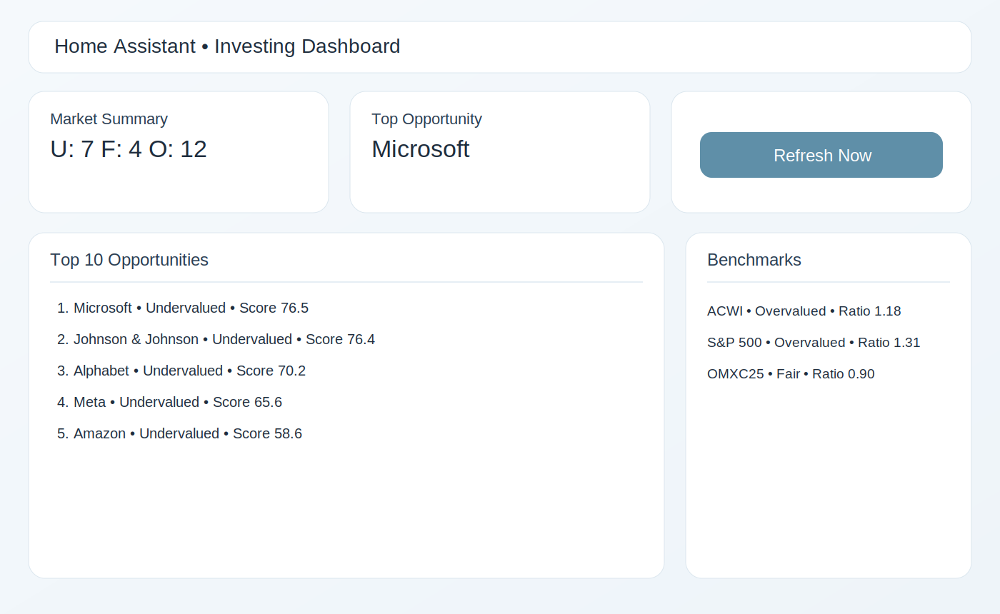
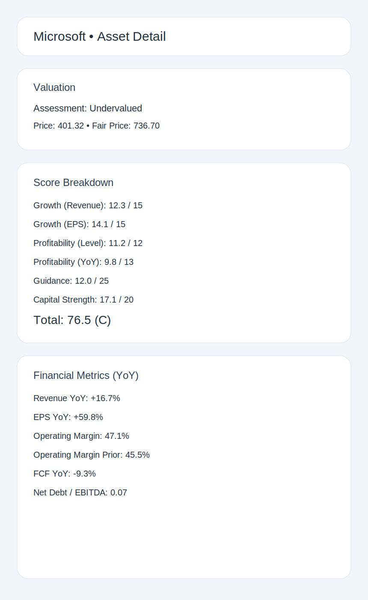

# homeassistant Investing Score Card

Home Assistant HACS integration for weekly investment ranking and valuation:
- 20 companies (S&P 500 + OMXC25)
- 3 index benchmarks (`ACWI`, `S&P 500`, `OMXC25`)
- Sector-aware fair value model (tech/software allowed higher PE)
- Ranking with top opportunities shown first

## Screenshots




## Data Model

Each asset includes:
- `score_total` and `grade` (`A+` to `F`)
- component scoring:
  - growth (`revenue_yoy`, `eps_yoy`)
  - profitability (`op_margin_level`, `op_margin_yoy`)
  - guidance (default `unchanged` weight)
  - capital strength (`fcf_yoy`, `net_debt_to_ebitda`)
- valuation:
  - current price
  - fair multiple + fair price
  - `Undervalued` / `Fair` / `Overvalued`

## Home Assistant Entities

- `sensor.<name>_top_opportunities`
  - state: top-ranked asset
  - attributes: sorted `top_10` list with full details
- `sensor.<name>_top_opportunity_1` ... `sensor.<name>_top_opportunity_10`
  - state: `Company (Assessment)`
  - click in dashboard to open popup (`more-info`) with:
    - score breakdown (growth, profitability, guidance, capital strength)
    - valuation (price, fair price, multiple ratio)
    - financial metrics (YoY, margins, leverage)
- `sensor.<name>_market_summary`
  - counts for undervalued/fair/overvalued
- `sensor.<name>_upcoming_earnings`
  - state: nearest upcoming earnings event
  - attributes: `events_next_5` calendar list used on start dashboard
- one sensor per asset
  - state: valuation assessment
  - attributes: score breakdown, metrics, fair price, valuation gap

## Weekly Updates

Built-in coordinator refresh interval: **7 days**.

Optional automation (recommended) to force refresh every Monday:

```yaml
alias: Investing Score Weekly Refresh
trigger:
  - platform: time
    at: "07:00:00"
condition:
  - condition: time
    weekday:
      - mon
action:
  - service: investing_score_card.refresh_data
mode: single
```

## Settings Menu (Customize Tickers)

In the integration options you can choose:
- `list_mode = default`: your default list (20 companies)  
- `list_mode = extend`: default list + your custom tickers  
- `list_mode = custom`: only your custom tickers
- `custom_tickers`: comma-separated symbols, e.g. `ASML,MSCI,SAP.DE`
- `include_benchmarks`: include ACWI, S&P 500 and OMXC25

Open: Settings -> Devices & Services -> homeassistant Investing Score Card -> Configure

## HA Native Styling

This integration is built to follow Home Assistant native UX (no custom applet UI).

- Example Lovelace view:
  - `docs/lovelace/dashboard.yaml`
- Optional soft native theme:
  - `docs/lovelace/theme_soft_native.yaml`

Style goals:
- rounded cards and buttons (`ha-card-border-radius`)
- light separators and borders
- clean tile/button layout (native cards only)
- top opportunities shown as clickable boxes with popup details
- refresh action in the top header row (right side)

## Manual Script

Generate a snapshot JSON outside HA:

```bash
python3 scripts/update_weekly_snapshot.py --output data/weekly_snapshot.json
python3 scripts/update_weekly_snapshot.py --list-mode extend --custom-tickers "ASML,MSCI,SAP.DE"
```

## Install

1. In HACS, add custom repository:
   - `https://github.com/nikolajflojgaard/homeassistant-investing-score-card`
   - category: `Integration`
2. Install integration and restart Home Assistant.
3. Add `homeassistant Investing Score Card` from Settings -> Devices & Services.
