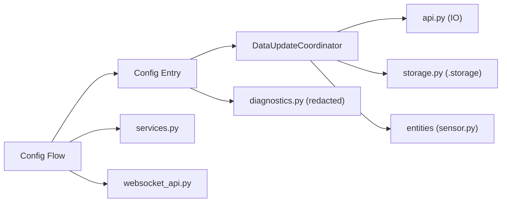

# Architecture

<!-- code-doc-pipeline:start -->

## Observed Structure

### Manifests

- `Makefile`
- `pyproject.toml`

### Entrypoints

- None detected

### Deployment Hints

- None detected

### Detected Frameworks

- None detected

## Diagrams

- [Context](diagrams/context.mmd)
- [Container or flow](diagrams/container-or-flow.mmd)
- [Critical sequence](diagrams/critical-sequence.mmd)
- [Data flow](diagrams/data-flow.mmd)
- [Deployment](diagrams/deployment.mmd)

## Detected Runtime Flows

- None detected

## Unknowns

- Confirm runtime boundaries with a service owner.
- Confirm whether detected interface hints are public APIs, internal routes, or framework conventions.
<!-- code-doc-pipeline:end -->
